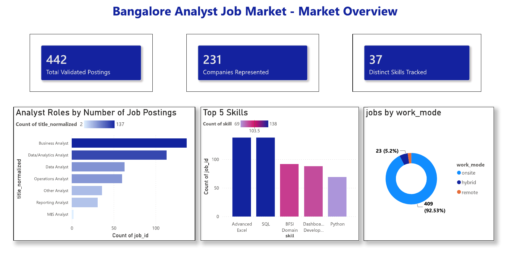
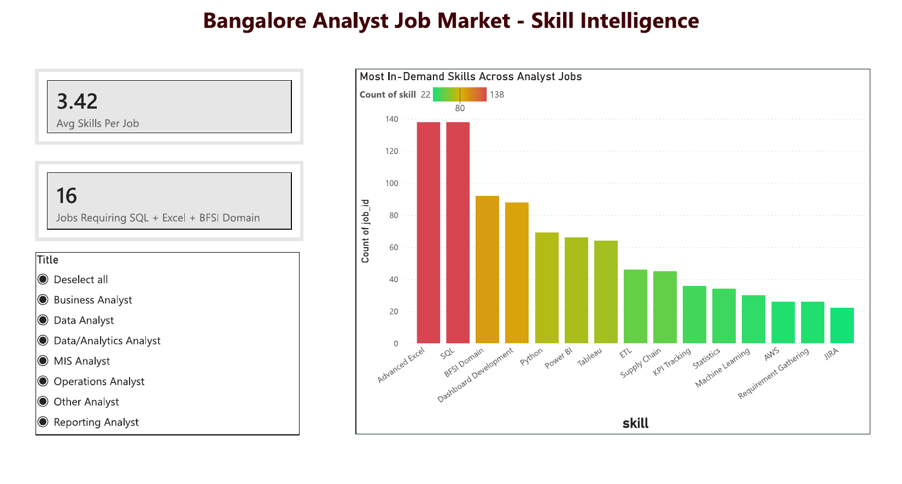
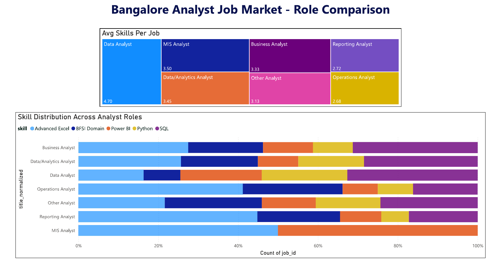
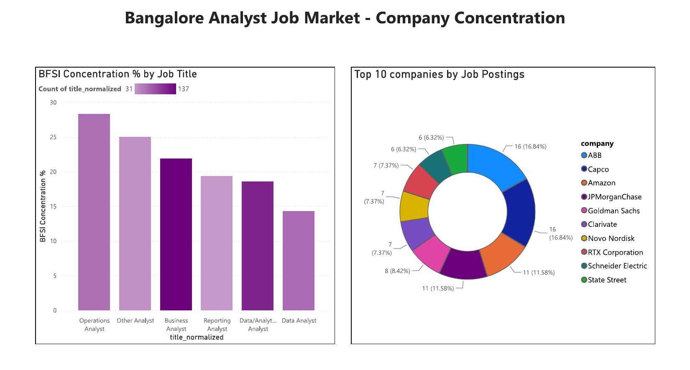

# Bangalore Analyst Job Market Tracker

A data investigation into why qualified freshers struggle to get hired in Bangalore's analyst job market — built end-to-end from data collection through a published case study and interactive Power BI dashboard.

**Case Study:** [Why Are Qualified Freshers Not Getting Hired?](case_study/case_study_v3.md)
**Published on Medium:** [Why Are Qualified Freshers Not Getting Hired?](https://medium.com/@nandanamk2702/why-are-qualified-freshers-not-getting-hired-22c5bbe8671f)
**Power BI Dashboard:** `Analysis_Dashboard.pbix`

---

## At a Glance

| Metric | Value |
|---|---|
| Validated analyst postings analyzed | **442** |
| Distinct companies represented | **232** |
| Distinct skills tracked | **37** |
| Average skills required per posting | **3.4** |
| Postings signaling entry-level intent | **23 (5.2%)** |

**Key findings:**
- Postings labeled "entry-level" don't reliably demand entry-level skill sets - 15.8% of them still ask for 5+ distinct skills
- SQL and Advanced Excel are each requested in 31.2% of postings individually, but only 15.2% require both together - common skills rarely overlap into specific combinations
- "MIS Analyst" as a standalone job title has nearly vanished (0.5% of postings); Business Analyst dominates demand (31.0%)
- The skill bundle itself changes by role: Operations Analyst is Excel + BFSI-domain heavy (avg 2.7 skills), while Data Analyst is SQL/Python/Power BI-heavy and broader (avg 4.7 skills)
- Hiring demand is broad-based - 232 companies, with the top 10 accounting for only 21.5% of total postings

Full reasoning, methodology, and limitations are in the [case study](case_study/case_study_v3.md).

---

## Project Structure

```
Job-Market-Analysis/
│
├── data/
│   └── job_market.db              ← SQLite database (auto-created)
│
├── scrapers/
│   ├── skill_extractor.py         ← Skill dictionary + extraction engine (37 tracked skills)
│   ├── adzuna_collector.py        ← Main data collector (Adzuna API)
│   ├── data_validator.py          ← Flags spam/vague/stale postings (non-destructive)
│   ├── fetch_full_descriptions.py ← Recovers full text beyond Adzuna's 500-char snippet
│   ├── reextract_skills.py        ← Re-runs skill extraction on recovered full text
│   ├── recompute_titles.py        ← Re-classifies role titles without re-collecting data
│   ├── naukri_scraper.py          ← Early attempt (abandoned — see Methodology Notes)
│   └── naukri_scraper_selenium.py ← Early attempt (abandoned — see Methodology Notes)
│
├── analysis/
│   ├── run_analysis.py            ← All 5 findings as runnable SQL-backed Python queries
│   └── health_check.py            ← Field-coverage and data-quality diagnostic report
│
├── case_study/
│   ├── case_study_v3.md           ← Final published case study (with embedded charts)
│   ├── generate_charts.py         ← Generates the 5 static chart images used in the article
│   └── visuals/                   ← Chart PNGs (one per finding)
│
├── dashboard_preview/
│   ├── market_overview.png
│   ├── skill_intelligence.png
│   ├── role_comparison.png
│   └── company_concentration.png
│
├── powerbi/
│   └── load_data.py                ← Python script Power BI uses to load pre-filtered data
│
├── Analysis_Dashboard.pbix         ← 4-page interactive Power BI dashboard
├── database_setup.py               ← Run once to create the database schema
└── README.md
```

---

## Setup (Run Once)

```bash
# 1. Clone the repo
git clone https://github.com/Nandana3/Job-Market-Analysis.git
cd Job-Market-Analysis

# 2. Install dependencies
pip install requests beautifulsoup4 pandas matplotlib --break-system-packages

# 3. Create the database
python database_setup.py
```

## Collecting Data

```bash
# Step 1 — collect postings from the Adzuna API
python scrapers/adzuna_collector.py

# Step 2 — flag spam/vague/stale postings (non-destructive)
python scrapers/data_validator.py

# Step 3 — recover full descriptions beyond Adzuna's 500-character snippet
python scrapers/fetch_full_descriptions.py

# Step 4 — re-run skill extraction now that full text is available
python scrapers/reextract_skills.py
```

## Running the Analysis

```bash
# All 5 findings, printed with real numbers
python analysis/run_analysis.py

# Full data-quality and field-coverage report
python analysis/health_check.py
```

## Regenerating Case Study Charts

```bash
python case_study/generate_charts.py
```

## Power BI Dashboard

1. Open `Analysis_Dashboard.pbix` in Power BI Desktop
2. If prompted to refresh, ensure Python scripting is configured (File → Options → Python scripting) with `pandas` installed in that environment
3. The dashboard auto-loads from `data/job_market.db` via `powerbi/load_data.py`, pre-filtered to the same 442 validated postings used in the case study

**Pages:**
1. **Market Overview** : KPI cards, role-type distribution, work-mode split, top-5 skill snapshot
2. **Skill Intelligence** : full top-15 skill ranking, SQL+Excel+BFSI combination-wall measure, role slicer
3. **Role Comparison** : interactive skill-bundle-by-role chart (proves the "skill ecosystem" finding live)
4. **Company & Sector Concentration** : top-10 companies, BFSI domain concentration by role

### Dashboard Preview

**Market Overview**


**Skill Intelligence**


**Role Comparison**


**Company & Sector Concentration**


---

## Methodology Notes

The original plan was to scrape Naukri.com directly. This was abandoned after about a day. Naukri runs enterprise-grade bot detection (Akamai), and every automated request was blocked. `naukri_scraper.py` and `naukri_scraper_selenium.py` remain in this repo as a record of that attempt, but are not part of the working pipeline.

The project pivoted to the **Adzuna API**, a legitimate, public job-search API covering India. This required several rounds of data validation not originally anticipated:
- Filtering out postings several years old that had persisted in Adzuna's index
- Fixing false "repeat poster" spam flags on large companies that simply post many genuinely distinct roles
- Recovering full job descriptions, since Adzuna's API only returns a 500-character snippet (recovered ~73-81% successfully via the original source URL)
- Fixing a skill-extraction bug where the job title itself was being miscounted as a skill (e.g., every "Business Analyst" posting inflating a fake skill called "Business Analysis")
- Separating genuine analyst roles from adjacent job families (Data Engineer, Data Scientist, Developer) that keyword search also pulls in

**Known data limitations**, disclosed in full in the case study:
- Salary is disclosed in under 3% of postings (consistent with the broader Indian job market)
- Experience requirements, when stated in free text, are only reliably parseable in ~15% of postings - a title-based entry-level signal is used instead
- This data covers job postings only; it cannot speak to ATS filtering, recruiter screening, or other post-application factors

---

## Tools Used

| Layer | Tool |
|---|---|
| Data collection | Python, Adzuna API, BeautifulSoup (full-text recovery) |
| Storage | SQLite |
| Validation & cleaning | Python (custom rule-based flagging) |
| Analysis | SQL (CTEs, joins, aggregations), Python |
| Visualization (article) | Matplotlib |
| Visualization (dashboard) | Power BI, DAX |
| Publishing | Medium, GitHub |

---

## Data

- **Source:** Adzuna API (public job listings)
- **Keywords:** Data Analyst, MIS Analyst, Business Analyst, Reporting Analyst, Operations Analyst
- **Location filter:** Bangalore
- **Date filter:** Last 30 days at time of collection
- **Final validated dataset:** 442 genuine analyst postings, from 727 raw postings collected

*Note: All data is publicly available information from job postings, collected via a legitimate, permitted public API.*