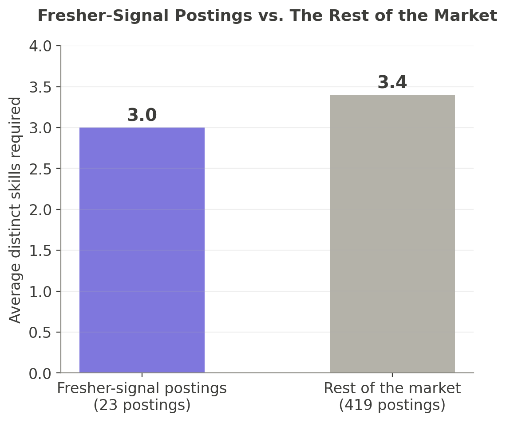
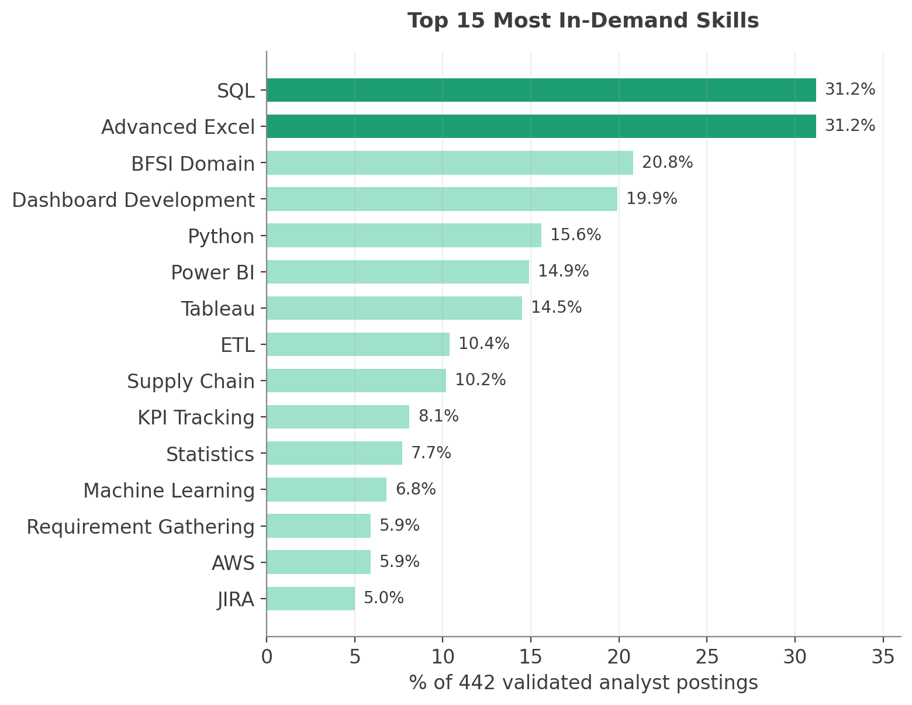
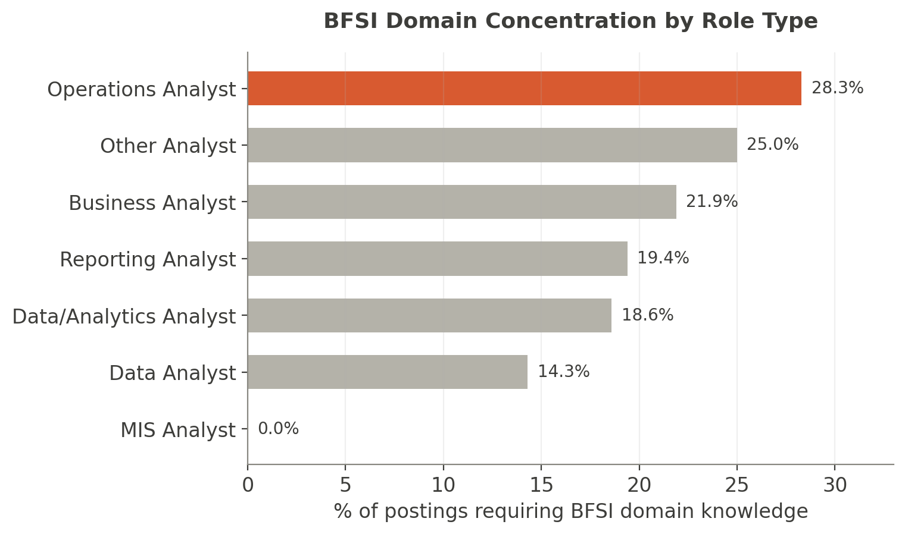
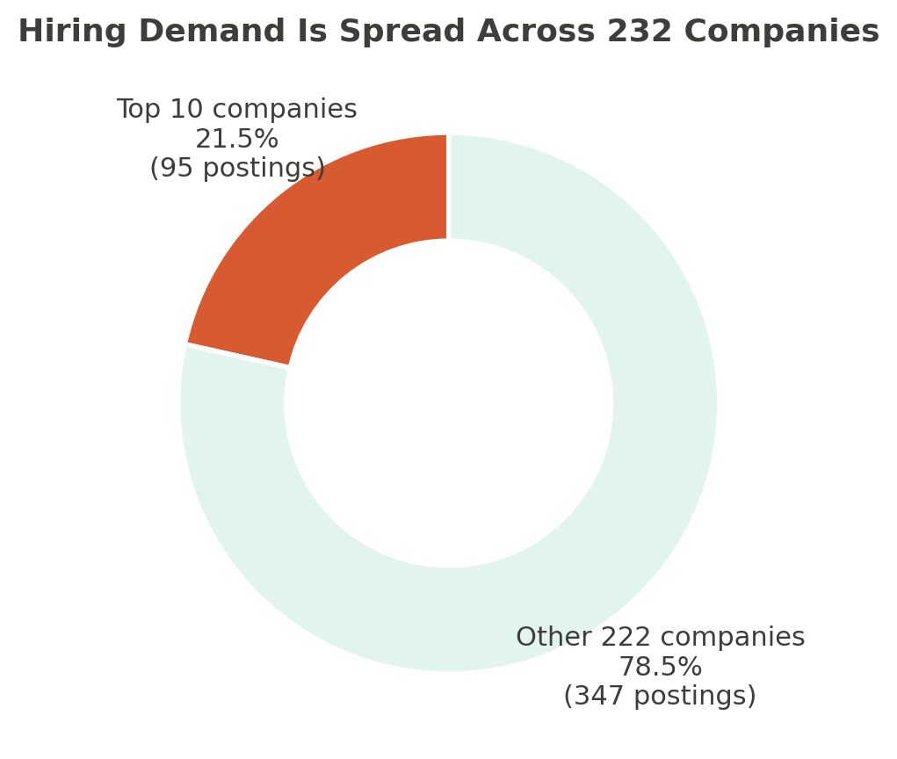
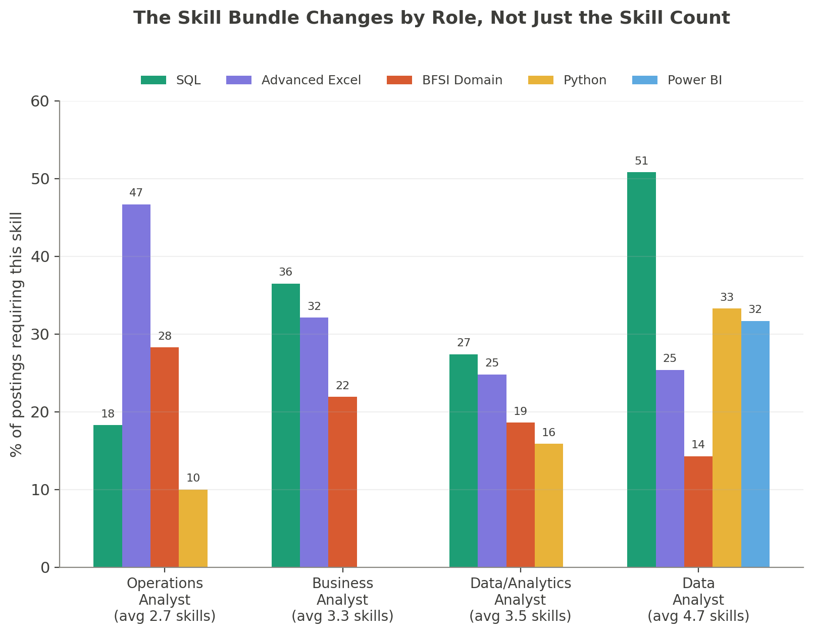

# Why Are Qualified Freshers Not Getting Hired?
### A Data Investigation into Bangalore's Analyst Job Market

I graduated with a Master's in Data Science, built real projects, picked up SQL and Power BI and Python along the way, and started applying. Hundreds of "Data Analyst" and "Business Analyst" openings show up in Bangalore on any given day. And yet, like thousands of other fresh graduates, most of my applications disappeared into silence.

The rejections that did come back followed a familiar script: *"we found a candidate whose experience aligns more closely with our requirements."* That line never sat right with me. If a posting is labeled entry-level, asking for 0-2 years of experience, what exactly is being measured when a more "experienced" candidate edges out a fresher? Either the posting wasn't really entry-level to begin with, or something about how these roles are described quietly filters freshers out before the interview stage even happens.

Everyone has a theory: "freshers lack experience," "the market is saturated," "you need more projects." But theories aren't evidence. So instead of guessing, I built a tool to collect real job posting data, and spent several weeks analyzing exactly what Bangalore's analyst market is actually asking for — not what we assume it's asking for.

This is what I found.

---

## The Data

The original plan was to scrape Naukri.com for Bangalore "Data Analyst," "Business Analyst," "MIS Analyst," "Reporting Analyst," and "Operations Analyst" postings. That lasted about a day — Naukri runs enterprise-grade bot detection, and every automated request came back blocked.

I pivoted to the **Adzuna API**, a public job-search API covering India that returns structured data instead of raw HTML. Over several weeks, I collected **546 postings** across the five role keywords, filtered to Bangalore and the last 30 days. From there:

- **Validating quality**: flagged vague, templated, and recruitment-agency-style postings (one account posted four near-identical "Require a Data Analyst in Bangalore" listings) — tagged, not deleted, so the noise itself became measurable.
- **Recovering truncated text**: Adzuna's API only returns a 500-character snippet per posting. A second pass fetched the full text from each posting's original source page, succeeding on 73% of postings.
- **Fixing a measurement bug**: an early version of my skill-extraction logic was counting the job title itself as a skill — every "Business Analyst" posting was inflating a fake skill called "Business Analysis." Catching this mattered, since it was distorting the most important number in this study.
- **Separating real analyst roles from adjacent titles**: keyword search also pulls in Data Engineers, Scientists, and Developers — real but different job families, excluded from every finding below.

After validation, **442 genuine, current Bangalore analyst postings** from **232 distinct companies** remained.

**What this data can and can't tell you:** skill mentions are well covered (74% of postings had at least one identifiable skill). Salary is rarely disclosed in Indian postings (under 3% here) and experience requirements are often stated where automated parsing misses them, so neither is used as a primary finding. This study also only examines what's written in job postings — it can't measure what happens after a resume is submitted; ATS filtering and recruiter screening are real factors no public job-posting data can speak to.

---

## Finding 1: The "Entry-Level" Label Doesn't Mean What You'd Expect

Only **23 of 442 postings (5.2%)** explicitly signal entry-level intent in the title — words like "trainee," "junior," "fresher," "graduate," or "associate." That alone is worth sitting with: barely one in twenty Bangalore analyst postings is labeled for someone starting out.

Among those 23, the skill bar is, on average, only slightly lower than the rest of the market — **3.0 skills versus 3.4** for everyone else. That's not the dramatic gap you'd expect if "fresher" postings were genuinely scaled down for beginners. And **15.8%** of them — roughly one in six — demand **5 or more distinct skills** despite the entry-level label. The most extreme example: hackajob's "Associate Business Analyst – Data & Reporting" posting asks for **9 distinct skills**, the kind of stack you'd expect from a multi-year hire, not someone explicitly labeled "Associate."

So the rejection line — *"we found someone whose experience aligns more closely"* — starts to make a strange kind of sense. If a posting tagged for freshers is quietly expecting near-market-level skill breadth, an experienced candidate genuinely will look like the safer choice, even on a role that was supposedly designed for someone like me.

---

## Finding 2: It's Not One Missing Skill — It's the Combination

"Learn SQL and you're set" is the advice every fresher hears. The data tells a more demanding story.

**SQL and Advanced Excel are each requested in 31.2% of postings** — the two most in-demand skills in the market, tied at the very top. If postings asked for these skills independently of each other, you'd expect most listings wanting one to also want the other. They don't: postings requiring **both SQL and Excel in the same listing** drop to **15.2%** — less than half. Two equally common skills, and most of the time, only one of them shows up.

Add a third skill and the gap widens further. **BFSI domain knowledge** is the third most-requested thing in the market, at 20.8%. Ask for SQL, Excel, and BFSI knowledge **all in the same posting**, and the number falls to **3.6%** — just 16 out of 442.

This analysis doesn't suggest that freshers lack skills. Instead, it suggests that employers rarely evaluate isolated skills — they evaluate combinations, and those combinations vary substantially across roles and industries. For applicants, the challenge isn't learning SQL or Excel. It's identifying which skill ecosystem a particular role belongs to before applying.

---

## Finding 3: Job Titles Can Mislead Your Job Search

**Business Analyst is the single largest category, at 31.0% of all postings** — nearly a third of the entire market. Data/Analytics Analyst comes next at 25.6%, then Data Analyst at 14.3%, then Operations Analyst at 13.6%.

And then there's **MIS Analyst — just 2 postings out of 442. 0.5% of the market.** If your resume, your projects, or your placement cell's advice is still built around "MIS Executive" as a target title, that pipeline barely exists anymore in Bangalore's current analyst market. The title hasn't disappeared from how people describe their skills — "MIS reporting" still shows up inside other roles — but as a standalone job title to search and apply for, it's nearly gone.

The more useful insight sits one layer deeper. Banking and financial services (BFSI) is the most-requested domain knowledge in the market — but the role most tied to it isn't the one you'd guess. **28.3% of Operations Analyst postings ask for BFSI knowledge, compared to 21.9% of Business Analyst postings** — even though Business Analyst has more than twice as many total openings. In other words: Business Analyst has more jobs overall, but if you specifically want to work in banking, a higher *proportion* of Operations Analyst roles will get you there. Volume and fit aren't the same thing, and chasing the bigger category isn't always the faster path into the sector you actually want.

---

## Finding 4: No Single Company Controls This Market — But Some Set the Bar Much Higher

Bangalore's analyst job market isn't dominated by a handful of big names. **442 postings come from 232 distinct companies**, and the **top 10 companies combined account for only 21.5% of total demand**. This is a genuinely broad-based market — opportunity isn't concentrated in a few famous employers, it's spread thin across hundreds of companies most freshers have never heard of.

That matters practically: chasing only the recognizable names (the Capcos, the JPMorgans, the Amazons) means competing for a small fraction of what's actually available. The other 78.5% of demand sits with companies that don't show up on anyone's "dream company" list.

But company identity does predict something real: how demanding the posting will be. Among companies with at least 3 postings, **ThermoFisher Scientific sets the highest bar, averaging 7.2 distinct skills per posting** — roughly double the market average of 3.4. Lowe's (6.7) and Amazon (5.8, across 11 postings — a large enough sample to trust) aren't far behind. If you're applying broadly and want to triage where to spend your effort, postings from companies like these are worth reading closely before you invest hours tailoring a resume for them.

---

## Finding 5: The Skill Bundle Itself Changes Depending on the Role

Finding 2 showed that common skills rarely combine. This raises an obvious follow-up: does the *specific* combination a posting wants depend on which role it is? Comparing the four largest role categories shows it clearly does.

**Operations Analyst postings ask for the fewest skills on average (2.7)**, but what they ask for is sharply focused: Advanced Excel (46.7%) and BFSI domain knowledge (28.3%) dominate, with SQL trailing well behind at 18.3%. **Data Analyst sits at the opposite end — the highest average skill count (4.7)** — led by SQL (50.8%), Python (33.3%), and Power BI (31.7%), a noticeably more technical, tool-heavy profile. **Business Analyst lands in between (3.3 average)**, SQL-led but with Dashboard Development and Tableau both showing up prominently.

This is a more useful way to think about Finding 2's "combination wall" than skill-counting alone. Companies don't hire SQL specialists or Excel specialists — they hire analysts who fit a particular skill ecosystem, and that ecosystem changes depending on which role you're looking at. A fresher targeting Operations Analyst roles is preparing for something different than one targeting Data Analyst roles, even though both postings say "Analyst" in the title. Knowing *which* ecosystem a posting belongs to may matter more than how many total skills it lists.

---

## What This Means, Practically

**For freshers:** Don't assume "entry-level" in the title means an entry-level skill bar — read the actual requirements, not just the label. If you're choosing between similar-sounding roles and one matters more to you for a specific sector (like BFSI), check which one is *proportionally* more aligned, not just which one has more total listings — Finding 3 shows those aren't always the same thing. And don't over-index on big-name employers: they're only 21.5% of total demand. The other 78.5% sits with companies you've likely never heard of, and that's where most of the real opportunity actually is.

**For colleges and placement cells:** If "MIS Executive" is still part of your placement pitch, it's worth checking against current postings — the title is down to 0.5% of this market. Curriculum and placement prep built around outdated title categories sends students toward a shrinking door.

**For hiring managers and recruiters:** Only 23 of 442 postings in this dataset (5.2%) explicitly say they're for entry-level candidates — and even among those, a real share quietly ask for a near-market-level skill set anyway. For the candidate on the other side, this isn't an abstract data point. It's the exact moment a fresher spends hours tailoring a resume, preparing for an assessment, for a role labeled "for someone like you" — only to be told, again, that someone with more experience was a closer fit. Do that enough times, and it stops feeling like bad luck and starts feeling like the door was never really open. If the goal is genuinely to hire freshers, the title and the requirements need to agree with each other. Right now, in a large share of cases, they don't.

---

## Conclusion

The question I started with was whether qualified freshers are genuinely being passed over, or whether something structural is going on. The data points toward the latter. Entry-level labels that don't match entry-level requirements. Common skills that rarely overlap into the specific combination a posting wants. Job titles that have quietly stopped existing. A market spread across hundreds of companies most of us never think to apply to.

None of this makes the job search easier. But it does make it less personal. The silence after an application isn't a verdict on your ability — more often, it's a mismatch between what a posting says and what it actually means. Worth knowing, before you spend another resume on a label that was never really telling the truth.
